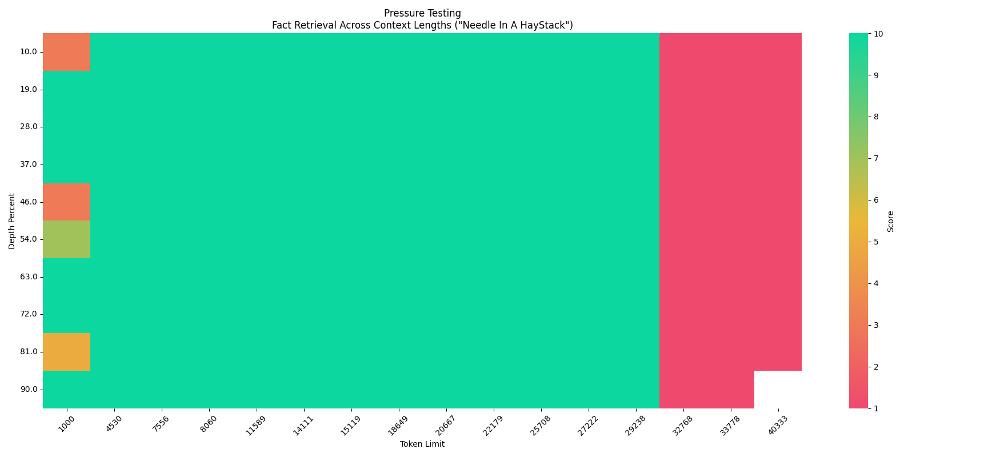

## Needle Test Evaluation

The code in this repository is a simplified version of [LongAlign](https://github.com/THUDM/LongAlign) preserving only the "Needle In A Haystack" evaluation.

**[They](https://github.com/THUDM/LongAlign) reconstructed the original "Needle In A Haystack - Pressure Test" [code](https://github.com/gkamradt/LLMTest_NeedleInAHaystack) to add support for evaluating HuggingFace models. The evaluation procedure involves 3 steps: *Test prompt generation*, *model predicting*, and *scoring*.**

### Environmental Setup

```bash
git clone https://github.com/Fzkuji/Needle-in-the-Haystack
cd Needle-in-the-Haystack
pip install -r requirements.txt

# For Llama based models, we recommend using FlashAttention 2 for optimization and saving GPU memory.
pip install flash-attn --no-build-isolation
```


### Test prompt generation

Configure the test parameters in `config-prompt.yaml`, then run
```bash
python prompt.py
```
The test prompts will be generated under `prompts/`.

### Model predicting

Set your model path (or HuggingFace path) in `config-pred.yaml`, then run
```bash
CUDA_VISIBLE_DEVICES=0 python pred.py
```
The model prediction will be saved under `pred/`.

### Scoring

Configure your scoring model (default as `gpt-4`) in `config-eval.yaml`, and your API key in `eval.py`. Run
```bash
python eval.py
```
The scoring result will be saved as *json* under `results/`.

Finally, visualize your result with
```bash
python vis.py
```

Below is the test result of [`Qwen2-0.5B-Instruct`](https://huggingface.co/Qwen/Qwen2-0.5B-Instruct) model:

